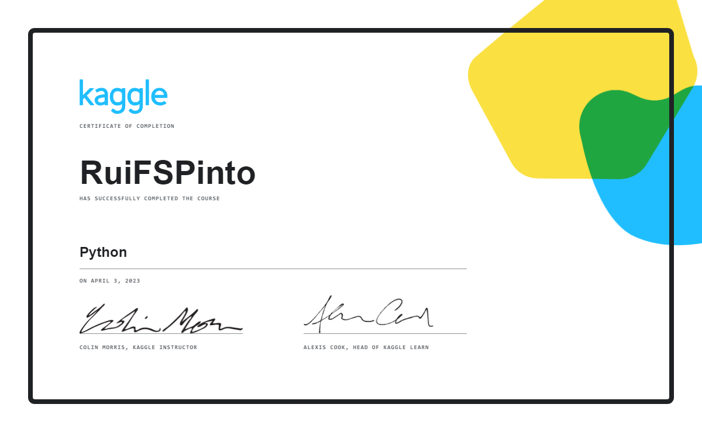

# Kaggle
My Kaggle Start

- Gain the skills you need to do independent data science projects:
  - [Module 1](https://github.com/RuiFSP/Kaggle/tree/main/Intro_to_Programming) - Intro_to_programming 
    - 1.1 - Arithmetics and Variables ✅
    - 1.2 - Functions ✅
    - 1.3 - Data Types ✅
    - 1.4 - Conditions and Conditional Statements ✅
    - 1.5 - Intro to Lists ✅
    
        
  - [Module 2](https://github.com/RuiFSP/Kaggle/tree/main/Python) - Python 
    - 2.2 - Functions and Getting Help ✅
    - 2.1 - Hello, Python ✅
    - 2.3 - Booleans and Conditionals ✅
    - 2.4 - Lists ✅
    - 2.5 - Loops and List Comprehensions ✅
    - 2.6 - Strings and Dictionaries ✅
    - 2.7 - Working with External Libraries ✅
    

  - [Module3]() - Intro to Machine Learning
    - 3.1 - How Models Work
    - 3.2 - Basic Data Exploration
    - 3.3 - Your First Machine Learning Model
    - 3.4 - Model Validation
    - 3.5 - Underfitting and Overfitting
    - 3.6 - Random Forest
    - 3.7 - Machine Learning Competitions